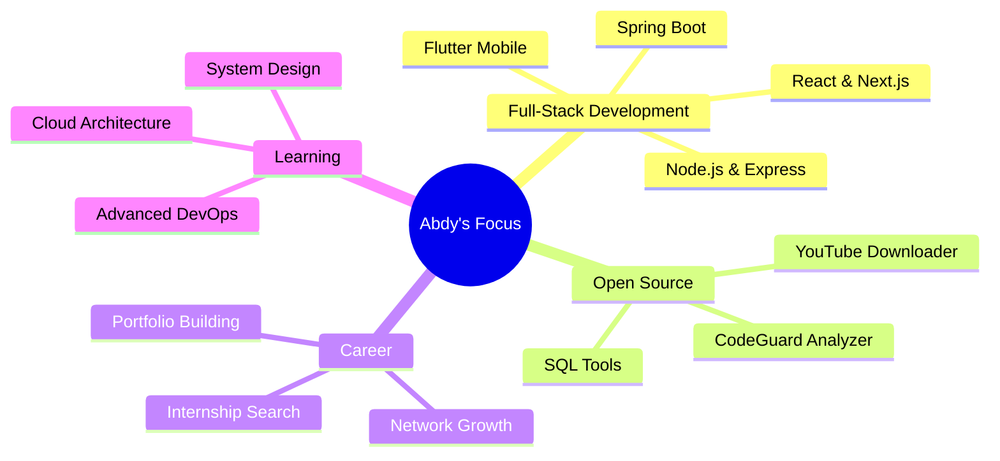

<div align="center">


<br/>

<p>
  <a href="mailto:24068@supnum.mr">
    
  </a>
  <a href="https://www.linkedin.com/in/abdy-mohameden-06953a329/">
    
  </a>
  <a href="https://user-badge.committers.top/mauritania_public/mohameden19961">
    
  </a>
  <a href="https://github.com/mohameden19961?tab=repositories">
    
  </a>
</p>

</div>

---


---

## 👨‍💻 About Me

```python
class Abdy:
    def __init__(self):
        self.name = "Mohameden Abdy"
        self.school = "SUPNUM Mauritania"
        self.major = "Web & Multimedia Development"
        self.role = "Full-Stack Developer"
        self.status = "Open for internships 🚀"
        self.contributions = 1802
        self.mega_project_commits = 1500
    
    def skills(self):
        return {
            "frontend": ["React", "Next.js", "TypeScript", "Tailwind"],
            "backend": ["Node.js", "Spring Boot", "Laravel", "Express"],
            "mobile": ["Flutter", "Dart"],
            "database": ["PostgreSQL", "MySQL", "SQLite", "Supabase"],
            "devops": ["Docker", "GitHub Actions", "Nginx", "Linux"],
            "languages": ["Python", "JavaScript", "TypeScript", "Java", "PHP", "Dart", "C++"],
        }
    
    def latest_achievement(self):
        return "Built CodeGuard: 1,500-commit Python analyzer with 12 PRs, plugin system, SARIF, auto-fix & GitHub Action"
```

📧 **[24068@supnum.mr](mailto:24068@supnum.mr)** — Always learning, always building.

---

## 🚀 Featured Projects

<table>
  <tr>
    <td width="50%" valign="top">
      <div align="center">
        
        
        <br/>
        
        
        
      </div>
      <p align="center">
        <b>🛡️ CodeGuard</b> — Python code quality & security analyzer.<br/>
        Plugin system · HTML dashboard · SARIF format · Auto-fix · Pre-commit hooks · GitHub Action · JSON Schema · 32 files
      </p>
      <p align="center">
        <a href="https://github.com/mohameden19961/opencode-mega-project"><code>View Repository →</code></a>
      </p>
    </td>
    <td width="50%" valign="top">
      <div align="center">
        
        <br/>
        
        
      </div>
      <p align="center">
        <b>📺 YouTube Downloader</b><br/>
        Download any YouTube video with a single command. Simple, fast, no bloat.
      </p>
      <p align="center">
        <a href="https://github.com/mohameden19961/youtube-downloader"><code>View Repository →</code></a>
      </p>
    </td>
  </tr>
  <tr>
    <td width="50%" valign="top">
      <div align="center">
        
        <br/>
        
        
      </div>
      <p align="center">
        <b>📚 Library API</b> — Spring Boot REST API.<br/>
        Soft-delete · FIFO queues · Borrow quotas · PostgreSQL
      </p>
      <p align="center">
        <a href="https://github.com/mohameden19961/springbootprojet"><code>View Repository →</code></a>
      </p>
    </td>
    <td width="50%" valign="top">
      <div align="center">
        
        <br/>
        
        
        
      </div>
      <p align="center">
        <b>📱 Flutter Course (FR)</b><br/>
        Complete Flutter course in French. Start with Dart, build real cross-platform apps.
      </p>
      <p align="center">
        <a href="https://github.com/mohameden19961/flutter-cours-complet-fr"><code>View Repository →</code></a>
      </p>
    </td>
  </tr>
  <tr>
    <td width="50%" valign="top">
      <div align="center">
        
        <br/>
        
      </div>
      <p align="center">
        <b>📊 SQL → ER Diagram</b><br/>
        Paste SQL CREATE TABLE statements, get a clean entity-relationship diagram instantly.
      </p>
      <p align="center">
        <a href="https://github.com/mohameden19961/sql-to-er"><code>View Repository →</code></a>
      </p>
    </td>
    <td width="50%" valign="top">
      <div align="center">
        
        <br/>
        
        
      </div>
      <p align="center">
        <b>🧩 Mermaid ER to Image</b><br/>
        Convert Mermaid ER diagrams to high-quality PNG/SVG. No backend needed.
      </p>
      <p align="center">
        <a href="https://github.com/mohameden19961/mermaid-er-to-image"><code>View Repository →</code></a>
      </p>
    </td>
  </tr>
</table>

---


---

## 🛠️ Tech Stack Details

<details>
  <summary><b>📌 Click to expand full tech tree</b></summary>
  <br/>

| Category | Technologies |
|----------|-------------|
| **Languages** |        |
| **Frontend** |    |
| **Backend** |     |
| **Mobile** |  |
| **Databases** |      |
| **DevOps** |     |
| **Testing** |   |
| **Tools** |     |

</details>

---


---

## 📊 GitHub Analytics Matrix

<div align="center">

| Metric | Value | Graph |
|--------|-------|-------|
| 🗓️ Total Contributions | **1,802** | ████████████████████ 100% |
| 📦 Public Repos | **66** | ████████████████░░░░ 80% |
| 🔄 Merged PRs | **12** | ████████░░░░░░░░░░░░ 40% |
| 🏆 Top Committer | **Mauritania** | ████████████████████ 100% |

</div>

<div align="center">

| | Stats | Streak | Languages |
|---|---|---|---|
| |  |  |  |

</div>

---

## 🏆 Trophies & Achievements

<div align="center">


</div>

---

## 🐍 Contribution Snake Animation

<div align="center">


</div>

---

## 📈 3D Contribution Graph

<div align="center">


</div>

---

## 📦 CodeGuard Mega Project Spotlight

<div align="center">

<table>
  <tr>
    <td align="center" colspan="2">
      <h2>🛡️ CodeGuard — 1,500 Commits</h2>
      <p><i>Python code quality & security analyzer built from scratch</i></p>
    </td>
  </tr>
  <tr>
    <td valign="top" width="50%">
      <b>📋 Project Stats</b>
      <ul>
        <li>1,500 commits on main branch</li>
        <li>32 source files, 3,500+ lines of code</li>
        <li>12 issues created & closed</li>
        <li>12 pull requests reviewed & merged</li>
        <li>All branches deleted post-merge</li>
        <li>Release v0.2.0 tagged</li>
      </ul>
    </td>
    <td valign="top" width="50%">
      <b>✨ Features Built</b>
      <ul>
        <li>Plugin system for custom checks</li>
        <li>Interactive HTML dashboard (Chart.js)</li>
        <li>SARIF 2.1.0 for Code Scanning</li>
        <li>Auto-fix for style issues</li>
        <li>Pre-commit hooks support</li>
        <li>GitHub Action for CI/CD</li>
        <li>JSON Schema config validation</li>
        <li>Incremental file scanner</li>
        <li>LRU cache eviction</li>
        <li>Binary file detection</li>
      </ul>
    </td>
  </tr>
  <tr>
    <td align="center" colspan="2">
      <pre><code>git clone https://github.com/mohameden19961/opencode-mega-project
cd opencode-mega-project
pip install -e .
codeguard analyze src/ --format dashboard --output report.html</code></pre>
      <a href="https://github.com/mohameden19961/opencode-mega-project">
        
      </a>
      
      
    </td>
  </tr>
</table>

</div>

---

## 🎯 Current Focus



---

## 🌐 Languages

<div align="center">

| 🇸🇦 Arabic | 🇫🇷 French | 🇬🇧 English |
|:----------:|:----------:|:-----------:|
| Native | Intermediate | Intermediate |
| ██████████ | ██████░░░░ | ██████░░░░ |

</div>

---

## 🔮 GitHub Metrics Card

<div align="center">


</div>

---

## 💡 Dev Quote

<div align="center">


<br/><br/>

<sub>
  <b>⚡ 1,802 contributions • 66 repos • 1,500-commit mega project • Open for internships</b>
  <br/>
  
  
</sub>

</div>
