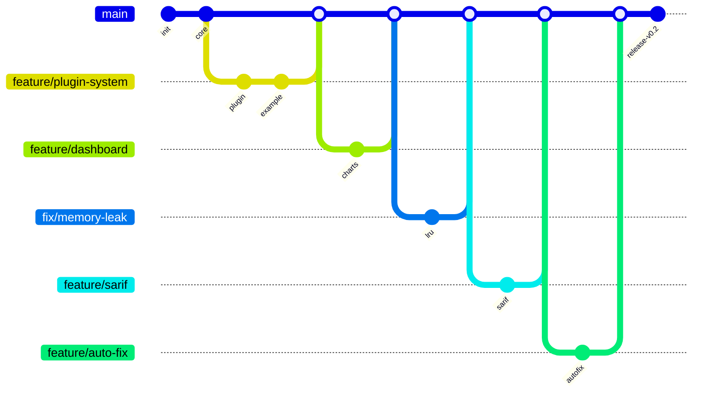

 

  
  
  
  

---

## 👨‍💻 About Me

Computer Science student at **SUPNUM Mauritania** (Web & Multimedia Development). I build clean, maintainable code — from PHP scripts to full-stack apps with React/Next.js, REST APIs, real-time detection systems, and a recent **1500-commit mega project** that pushed my total past **1,800+ contributions**.

📧 [24068@supnum.mr](mailto:24068@supnum.mr) — open to internships & junior dev roles.

---

## 🚀 Featured Projects

<table>
  <tr>
    <td width="50%" valign="top">
      <h3>📺 YouTube Downloader</h3>
      
<i>⭐ 4 — HTML</i>

      
Download any YouTube video with a single command. Simple, fast, no bloat.

      <a href="https://github.com/mohameden19961/youtube-downloader"><code>View on GitHub →</code></a>
    </td>
    <td width="50%" valign="top">
      <h3>📚 Spring Boot Library API</h3>
      
<i>⭐ 1 — Java/Spring Boot</i>

      
REST API for library management with soft-delete, FIFO queues, and borrow quotas.

      <a href="https://github.com/mohameden19961/springbootprojet"><code>View on GitHub →</code></a>
    </td>
  </tr>
  <tr>
    <td width="50%" valign="top">
      <h3>📱 Flutter Course (FR)</h3>
      
<i>⭐ 1 — Dart/Flutter</i>

      
Complete Flutter course in French. Start with Dart, build real apps.

      <a href="https://github.com/mohameden19961/flutter-cours-complet-fr"><code>View on GitHub →</code></a>
    </td>
    <td width="50%" valign="top">
      <h3>📊 SQL → ER Diagram</h3>
      
<i>JavaScript</i>

      
Paste SQL CREATE TABLE statements and get a clean entity-relationship diagram instantly.

      <a href="https://github.com/mohameden19961/sql-to-er"><code>View on GitHub →</code></a>
    </td>
  </tr>
  <tr>
    <td width="50%" valign="top">
      <h3>🧩 Mermaid ER to Image</h3>
      
<i>JavaScript</i>

      
Convert Mermaid ER diagram code to high-quality PNG/SVG. No backend needed.

      <a href="https://github.com/mohameden19961/mermaid-er-to-image"><code>View on GitHub →</code></a>
    </td>
    <td width="50%" valign="top">
      <h3>🔭 DevScope</h3>
      
<i>⭐ 1 — TypeScript</i>

      
Developer productivity and scope management tool.

      <a href="https://github.com/mohameden19961/devscope"><code>View on GitHub →</code></a>
    </td>
  </tr>
</table>

### 🏅 Featured Mega Project

<table>
  <tr>
    <td width="70%" valign="top">
      <h3>🛡️ CodeGuard — Python Code Quality Analyzer</h3>
      
<i>1,500 commits — 32 files — 3,500+ lines of code</i>

      
A comprehensive Python code quality and security analysis tool featuring a plugin system, interactive HTML dashboard, SARIF format for GitHub Code Scanning, auto-fix capabilities, pre-commit hooks, GitHub Action, JSON Schema validation, incremental scanning, and more — all built with a full GitHub workflow (12 issues, 12 PRs, code review, releases).

      <a href="https://github.com/mohameden19961/opencode-mega-project"><code>View on GitHub →</code></a>
    </td>
    <td width="30%" valign="top">
      
    </td>
  </tr>
</table>

---

## 🛠️ Tech Stack

<table>
  <tr>
    <td valign="top" width="20%"><b>Languages</b></td>
    <td>
      
      
      
      
      
      
      
    </td>
  </tr>
  <tr>
    <td valign="top"><b>Frontend</b></td>
    <td>
      
      
      
    </td>
  </tr>
  <tr>
    <td valign="top"><b>Backend</b></td>
    <td>
      
      
      
      
    </td>
  </tr>
  <tr>
    <td valign="top"><b>Mobile</b></td>
    <td>
      
    </td>
  </tr>
  <tr>
    <td valign="top"><b>Databases</b></td>
    <td>
      
      
      
      
      
    </td>
  </tr>
  <tr>
    <td valign="top"><b>DevOps</b></td>
    <td>
      
      
      
      
    </td>
  </tr>
  <tr>
    <td valign="top"><b>Testing</b></td>
    <td>
      
      
    </td>
  </tr>
  <tr>
    <td valign="top"><b>Tools</b></td>
    <td>
      
      
      
      
    </td>
  </tr>
</table>

---

## 📊 GitHub Analytics

| Metric | Value |
|--------|-------|
| 🗓️ **Total Contributions** | 1,802 |
| 📦 **Public Repos** | 66 |
| 👥 **Followers** | 3 |
| 🔄 **Following** | 3 |
| 🏅 **Mauritania Rank** | Public committer |

&nbsp;

---

## 🏆 GitHub Trophies

---

## 📈 Recent Activity

_CodeGuard mega-project (1,500 commits) — 12 issues, 12 pull requests, full GitHub workflow:_

---

## 🌐 Langues

| Arabic | French | English |
|--------|--------|---------|
| 🇸🇦 Native | 🇫🇷 Intermediate | 🇬🇧 Intermediate |

---

---

---

  
    
  ⚡ 1,802 contributions • 66 repos • 1,500-commit project • Always building

