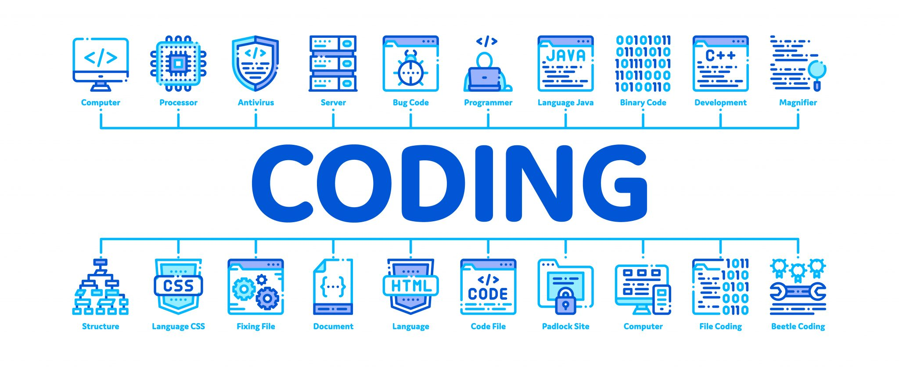

<!-- Typing SVG -->

 

  
  &nbsp;
  
  &nbsp;
  
  &nbsp;
  

---

## 👨‍💻 About Me

I'm a Computer Science student at **SUPNUM Mauritania** (Web & Multimedia Development), actively looking for my first internship as a web or fullstack developer. I've gone from writing my first PHP script to shipping REST APIs, full-stack web apps with React and Next.js, and real-time detection systems — and I'm not slowing down.

My approach to code is simple: **write it clean, make it work, make it last.** I'm driven by curiosity and the conviction that every project, even a small one, is an opportunity to do something well.

> Currently open to **internships and junior developer opportunities** — remote or on-site.
> 📧 [24068@supnum.mr](mailto:24068@supnum.mr)

---

## 🛠️ Tech Stack

#### Languages

  
  
  
  
  
  
  

#### Frameworks & Libraries

  
  
  
  
  
  
  
  
  

#### Databases & Cloud

  
  
  
  
  
  
  

#### Testing

  
  
  

#### CI/CD & DevOps

  
  
  

#### Design & UI

  
  

#### Tools & Platforms

  
  
  
  
  
  
  
  

---

## 📊 GitHub Stats

&nbsp;

 

---

## 🏆 GitHub Trophies

---

## 🐍 Contribution Snake

---

## 🌐 Langues parlées

---

## 🌊 Activity Graph

---

## 💬 Quote du jour

